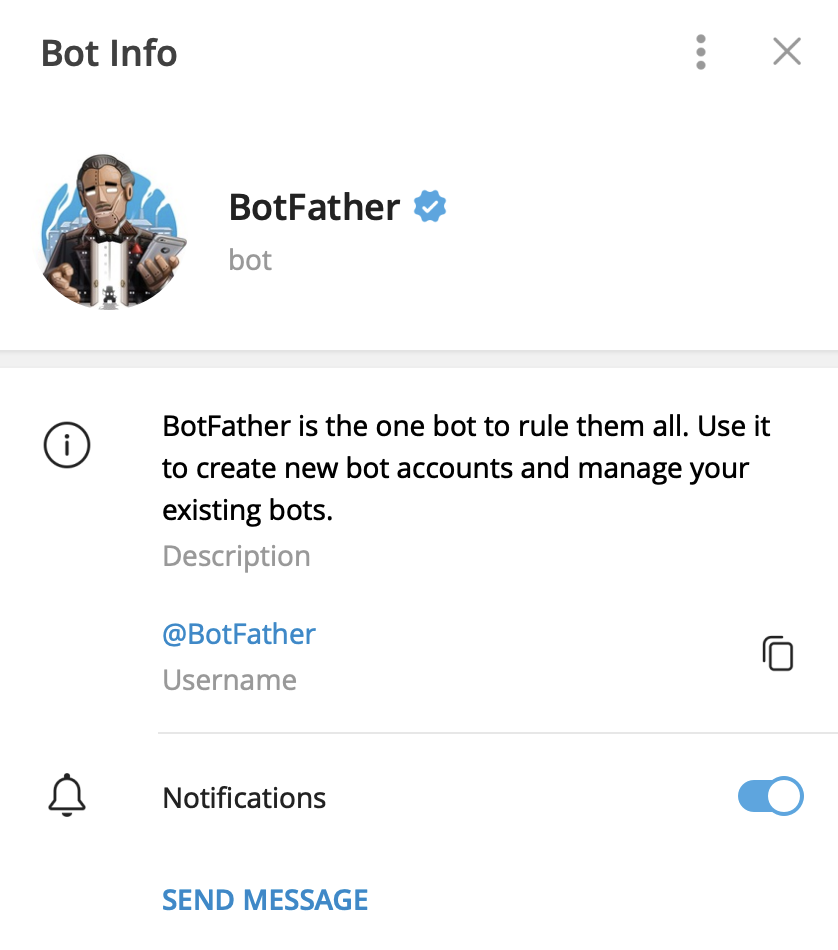
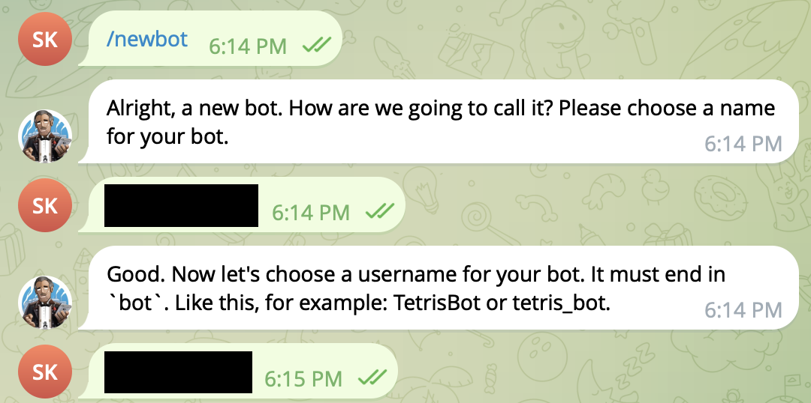
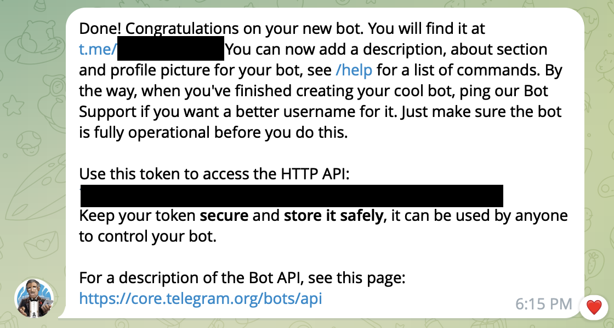

# 텔레그램 봇에 메시지 보내는 방법

## 들어가기에 앞서
이 레포지토리는 파이썬을 이용하여 텔레그램 봇에 메시지를 보내는 함수가 있습니다.
원활한 이용을 위해서는 아래 커맨드를 이용하여 필요 패키지를 설치해주셔야 합니다.
``` sh
pip install -r requirements.txt
```

정상 동작을 테스트한 환경 정보는 아래와 같습니다.
``` 
Machine : M1 Macbook Pro 14
Python : 3.12
Packages
- requests : 2.32.3
- python-telegram-bot : 21.3
```

## 봇을 만든다.

### Bot Father 를 검색해서 들어간다.

- 비슷한 사칭 계정들이 많으니 아래 정보를 확인하고 추가하자.

### 봇을 만든다.

- 위의 사진처럼 Bot Father에게 명령을 하고 두 번의 이름을 정하면 된다.

### Token을 받는다.

- 위의 이미지에서 HTTP API 아래에 적혀있는 긴 문구가 Token 이다.

## 채팅 ID를 가져온다.

### 공통
`https://api.telegram.org/bot{token}/getUpdates`
- 위 링크에 Bot Father로부터 발급받은 token을 넣어준다.
- 예시) 
``` sh
# token 이름이 123MyTestToken123 인 경우
https://api.telegram.org/bot123MyTestToken123/getUpdates
```

### 봇과의 개인 챗에서 ChatID를 가져오는 방법
- 말을 건다
- 위 링크(`https://api.telegram.org/bot{token}/getUpdates`)를 새로고침 한다
- 또는 아래 함수를 실행해서 chat id를 가져온다.
```python
python3 telegram_chatid_getter.py -t your_bot_token
```
- `-t` 또는 `--token` : 봇 토큰

### 채널에 추가한 봇
- 채널에 추가한다
- 위 링크(`https://api.telegram.org/bot{token}/getUpdates`)를 새로고침 한다
- 또는 아래 함수를 실행해서 chat id를 가져온다.
```python
# -c : channel
python3 telegram_chatid_getter.py -t your_bot_token -c
```
- `-t` 또는 `--token` : 봇 토큰
- `-c` 또는 `--channel` : 채널 여부 플래그

## 메시지를 보낸다.
아래와 같이 파이썬 파일을 실행시켜 메시지를 보낸다.
``` python
python3 telegram_message_sender.py -t your_bot_token -i your_chat_id -m your_message
```
- `-t` 또는 `--token` : 봇 토큰
- `-i` 또는 `--chatid` : 메시지를 보낼 챗의 아이디
- `-m` 또는 `--message` : 보낼 메시지
